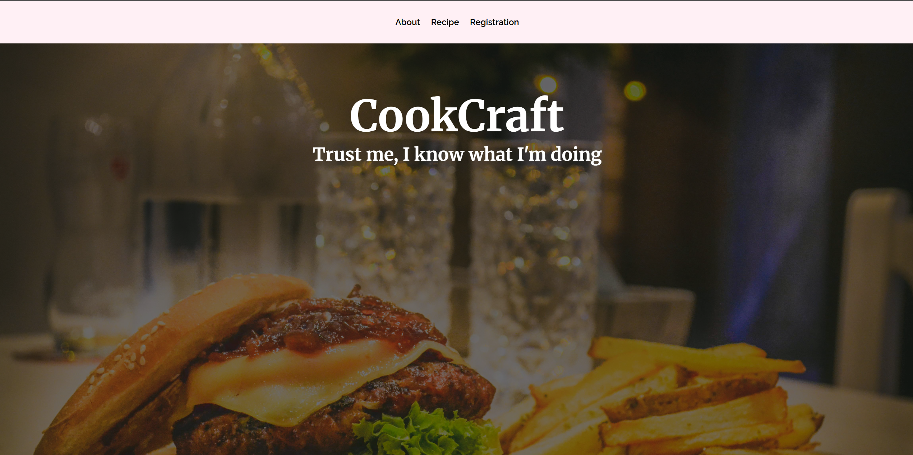

# About

CookCraft is a recipe website for users to create a recipe. This is my first project built from Janurary to June. 

# Programming Languages Used

- Front end Languages: HTML, CSS, Javascript
- Back end language: Java
- Database: MySQL
- Framework: Spring Boot, Thymeleaf

# Features

- User Registration and Login
- Admin and Manager full CRUD (Create, Read, Update, Delete)
- Recipe rating and review

# How to Run Locally

1. Fork and clone the project to your machine
2. Update the MySQL connection in ``` application.properties ``` with your local database credentials.
3. Run the Spring Boot application
4. Access the app via ``` localhost:8080 ```.
